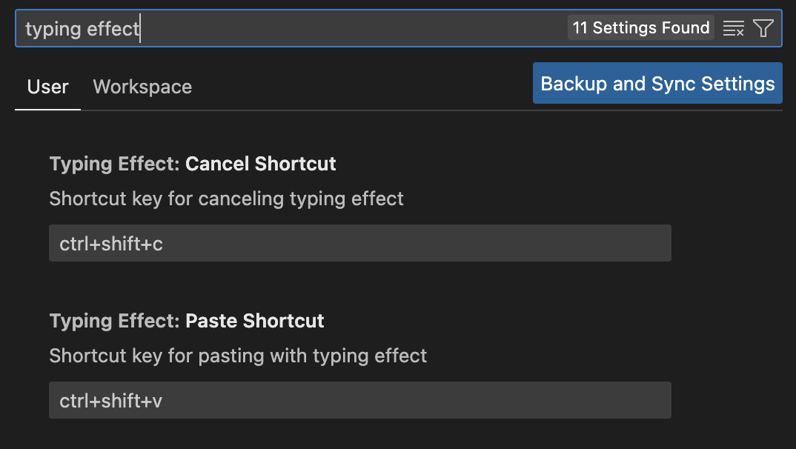

# Paste with Typing Effect

Paste, and then there is a typing effect, like this:

Paste with Typing Effect is a Visual Studio Code extension that allows you to paste text with a typing effect, one character at a time. This extension is useful for creating a more dynamic and engaging experience when pasting text into your code editor.

It can be used for various purposes, such as simulating typing, creating a more interactive experience, or simply adding a fun effect to your text pasting. Maybe this is very useful for you when you are writing a blog post, a tutorial, a presentation, a screencast, or a video.

This extension is designed to be lightweight and easy to use, with a simple command that can be triggered from the command palette or by using a keyboard shortcut.

## How to Use

Command + Shift + V: to paste text with a typing effect.

Command + Shift + C: to cancel and stop the typing effect.

## Custom Keybinding
You can customize the keybinding for the typing effect command by open settings and searching for "Typing Effect". You can change the keybinding to any combination of keys that you prefer.

## Security
This extension is not a security risk. It does not access any sensitive information or perform any actions that could compromise your system. 

We do not collect any data from users or send any information to external servers. The extension only interacts with the clipboard and the text editor in Visual Studio Code. 

This extension is safe to use and does not pose any security threats. Our source code is open source and can be reviewed by anyone. If you have any concerns about security, please feel free to contact us.

## License
This project is licensed under the MIT License. See the [LICENSE](./LICENSE) file for details.

## Contributing & Source Code
If you would like to contribute to this project, please feel free to submit a pull request or open an issue. We welcome contributions from the community and appreciate any feedback or suggestions.

The source code for this extension is available on [GitHub](https://github.com/maventama/typing-effect-extension).